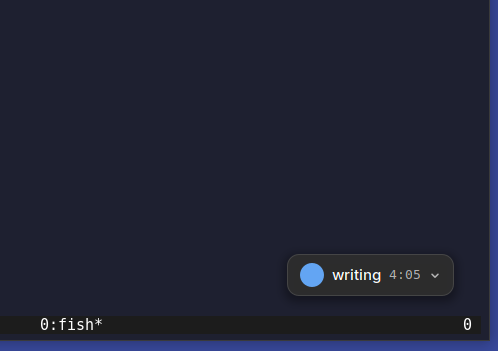

# FocusOn for NixOS and GNOME

The GNOME port of **FocusOn.app**, the macOS widget in `../FocusOn`. Same job,
same files on disk: a floating widget that keeps your current task visible and
appends work sessions to the CSV logs the `focuson` CLI turns into invoices.

A data directory is portable between the two. Sync one over git and the macOS
widget, the GNOME widget and the CLI all read and write it interchangeably.



## Why this is a Shell extension and not a GTK app

The macOS widget is a borderless `NSPanel` at `.floating` level with
`canJoinAllSpaces` and `fullScreenAuxiliary` — a small window that outranks
every other window, follows you between Spaces, sits above fullscreen apps, and
can be dragged to an exact pixel.

None of that is available to a GNOME application:

- Under Wayland a client cannot position its own surface, cannot raise itself
  above other windows, and cannot ask to stay on top. These are compositor
  decisions by design.
- The usual escape hatch, `wlr-layer-shell`, is not implemented by Mutter, so
  `gtk4-layer-shell` does not work on GNOME.
- An X11-only build would work but would stop working on the Wayland session
  that NixOS and GNOME both default to.

The one process on a GNOME desktop that *can* do all of it is the compositor
itself. So the widget is a Clutter actor in the Shell's own chrome, which gets
the entire `NSPanel` behaviour list for free — above every window including
fullscreen ones, present on every workspace, positioned to the pixel — and the
top-bar indicator replaces the menu-bar item at the same time.

## Install

### NixOS, with flakes

```nix
{
  inputs.focuson.url = "github:ckritzinger/focus_on";

  outputs = { nixpkgs, focuson, ... }: {
    nixosConfigurations.yourhost = nixpkgs.lib.nixosSystem {
      modules = [
        focuson.nixosModules.default
        { programs.focuson.enable = true; }
      ];
    };
  };
}
```

That installs the `focuson` CLI and the extension system-wide. Turn the
extension on in the Extensions app, or set
`programs.focuson.gnomeExtension.enableByDefault = true` to seed it as a dconf
default for every user.

### Home Manager

The per-user half, which is where FocusOn really belongs — one person's tasks,
one person's data directory, one person's backup schedule:

```nix
{
  imports = [ focuson.homeManagerModules.default ];

  programs.focuson = {
    enable = true;
    dataDir = "${config.home.homeDirectory}/focuson-data";
    sync = {
      enable = true;   # daily systemd user timer, instead of `focuson cron install`
      time = "18:00";
    };
  };
}
```

`gnomeExtension.enableByDefault` is available here too, and off for the same
reason: GNOME stores enabled extensions as one list, so declaring it makes Home
Manager the sole authority on which extensions you run.

### Any other GNOME distro

```bash
./install-gnome.sh
```

Copies the extension into `~/.local/share/gnome-shell/extensions/`, compiles its
schema, builds the CLI into `~/.local/bin`, and installs the daily sync timer.
On Wayland you have to log out and back in — the shell cannot reload itself in
place, so there is no `Alt+F2 r`.

### Just the extension

```bash
cp -r "gnome/focuson@ckritzinger.github.io" ~/.local/share/gnome-shell/extensions/
glib-compile-schemas ~/.local/share/gnome-shell/extensions/focuson@ckritzinger.github.io/schemas
# log out and back in, then:
gnome-extensions enable focuson@ckritzinger.github.io
```

The log-out is not optional and it comes *first*. gnome-shell scans for
extensions once, as the session starts, with no file monitor on any of the
directories it looks in. `gnome-extensions enable` asks the running shell to
enable something it already knows about, so running it before a fresh session
fails with `Extension "focuson@ckritzinger.github.io" does not exist`.

To skip one of the two log-outs, write the setting instead — it is a plain
dconf list that the shell reads on the way up, so it can name an extension the
running shell has never heard of:

```bash
gsettings set org.gnome.shell enabled-extensions \
  "['focuson@ckritzinger.github.io']"   # careful: replaces the whole list
```

## What maps to what

| macOS | GNOME |
|---|---|
| Floating `NSPanel`, draggable | Clutter actor in the Shell's chrome, draggable |
| Menu bar item | Top-bar indicator |
| `NSPopover` action menu | `PopupMenu`, on both the indicator and the widget |
| Task picker / Log past session popovers | `ModalDialog`, which reliably takes the keyboard |
| `NSOpenPanel` for the data directory | Folder picker in the extension's preferences window |
| `UserDefaults` | `GSettings` (`org.gnome.shell.extensions.focuson`) |
| Launch at login | Not applicable — an extension runs when the shell does |
| Quit | Turn off FocusOn, which disables the extension |
| `launchd` LaunchAgent for daily sync | systemd user timer, `Persistent=true` |
| `applicationWillTerminate` | `disable()` |

## Beyond the macOS app: "Actually, I…"

Not in FocusOn.app, and on its own branch because it may or may not belong
upstream.

The timer says "Writing" and has said so for forty minutes. The forty minutes
went on fiddling with FocusOn. Pausing loses the distinction; completing files
it as writing you never did. **Actually, I…** asks what really happened, bills
the elapsed time to that instead, and then offers the original task back with
its name pre-filled, so getting on with what you meant to do is one keystroke.

It needs no change to the CSV format, because the format already allows it. A
session contributes exactly one row to an invoice — the closing one, since
`internal/invoicing` skips every row with an empty `to` — and the task name
billed is the one written there. So the closing row carries the real task name
while the opening row keeps the name you started under. The log still records
that you meant to be writing, which is the honest version of events and the
point of an append-only file.

```
uuid-1,"Writing",             09:00,      ,        # you meant to write
uuid-1,"Fiddling with FocusOn",09:00, 09:40, true   # you did not
uuid-2,"Writing",             09:40, 10:40, true   # then you did
```

That invoices as 0.67h of fiddling and 1.00h of writing. Nothing is
double-counted, and the shared uuid keeps the session properly closed, so the
CLI's integrity check stays happy.

**It cannot move time between projects**, and that is a real limitation rather
than an oversight. The closing row has to land in the same `task_log.csv` as
the row it closes; putting it in another project's file would leave the
original project holding a uuid that never closes, which is exactly the
dangling entry the CLI refuses to run against. Procrastinating from a client
project into a personal one is a genuine case this does not express. Doing it
properly needs the CLI to learn a way of voiding a session, which is a format
change and a conversation with upstream.

## Deliberate differences

**The screen lock does not end your session.** `metadata.json` lists the
`unlock-dialog` session mode, so the extension keeps running while the screen is
locked. Without it, every lock would write a closing row and every unlock would
open a new one, chopping an afternoon into fragments. The widget itself hides
while locked — a task name does not belong on a lock screen.

**Times are typed, not picked.** SwiftUI's `DatePicker` has no St equivalent, so
"Log past session" takes `YYYY-MM-DD HH:MM` in two text fields. Dates that don't
exist are rejected rather than silently rolled forward.

**Projects are chips, not a dropdown.** A popup menu inside a modal dialog is a
fight; a scrolling row of chips shows the choice and the options at once.

**The startup prompt is optional.** The macOS app opened its task picker on
every launch with nothing tracked. That is still the default, but a Shell modal
takes a keyboard grab, which is heavier at every login than the popover it
stands in for. Turn it off in preferences.

**"Launch at login" became "Show floating widget".** The original toggle has no
meaning for an extension. What a GNOME user actually wants to switch off is the
widget, so that is what the menu offers; tracking continues either way.

## Data compatibility

The extension writes `projects/<slug>/task_log.csv` in the documented schema, with
RFC 3339 timestamps carrying a real local offset — the form Go's
`time.Parse(time.RFC3339, …)` accepts. It is written by hand in `lib/format.js`
rather than taken from `GLib.DateTime.format_iso8601()`, which emits a minimal
`+02` offset that the Go parser rejects.

The data directory is read from, and written to, the CLI's own
`~/.config/focuson/config.toml` — one file shared by both sides, as on macOS,
so there is no second copy to fall out of sync. The extension watches that file,
so setting the directory from the CLI, or from the preferences window, is picked
up by a running widget.

Sessions stay append-only. A completed session is two rows sharing one UUID: an
open marker written when it starts, a close row written when it ends. The Go
integrity checker's rule — an unclosed UUID that isn't the last row is presumed
abandoned — depends on exactly that, and the port preserves it, including
starting a *new* UUID rather than resuming an old one when the shell restarts.

## Development

```bash
nix develop            # go, node, glib, git
node --test tests/     # the CSV/timestamp contract with the Go CLI
npx eslint .           # catches typo'd identifiers, which GNOME only reports in a log
```

`lib/format.js` and `lib/taskStore.js` deliberately import nothing from
`gi://` — the first holds everything the extension and the Go CLI must agree
on, the second is the state machine whose output is someone's billing record.
Both can therefore be tested without a GNOME session, and both are, as the Nix
package's check phase. `TaskStore` takes its logger as a constructor argument
for exactly this reason.

Everything else needs a real GNOME session to exercise. `journalctl --user -f -o
cat /usr/bin/gnome-shell` is where errors go.

## Layout

```
gnome/focuson@ckritzinger.github.io/
├── metadata.json          # uuid, shell versions, session modes
├── extension.js           # lifecycle, indicator, menus — port of AppDelegate
├── prefs.js               # preferences window; the only place a folder picker can live
├── stylesheet.css         # port of the SwiftUI chrome
├── schemas/               # GSettings, standing in for UserDefaults
└── lib/
    ├── format.js          # pure: CSV rows, RFC 3339, elapsed and relative time
    ├── csvLogger.js       # file I/O — port of CSVLogger.swift
    ├── taskStore.js       # state machine — port of TaskStore.swift
    ├── widget.js          # the floating widget — port of FloatingPanel + WidgetView
    ├── dialogs.js         # task picker and past-session entry
    ├── actionMenu.js      # port of ActionPopoverView + "Actually, I…"
    └── compat.js          # the two St APIs that moved between GNOME 45 and 49
```
